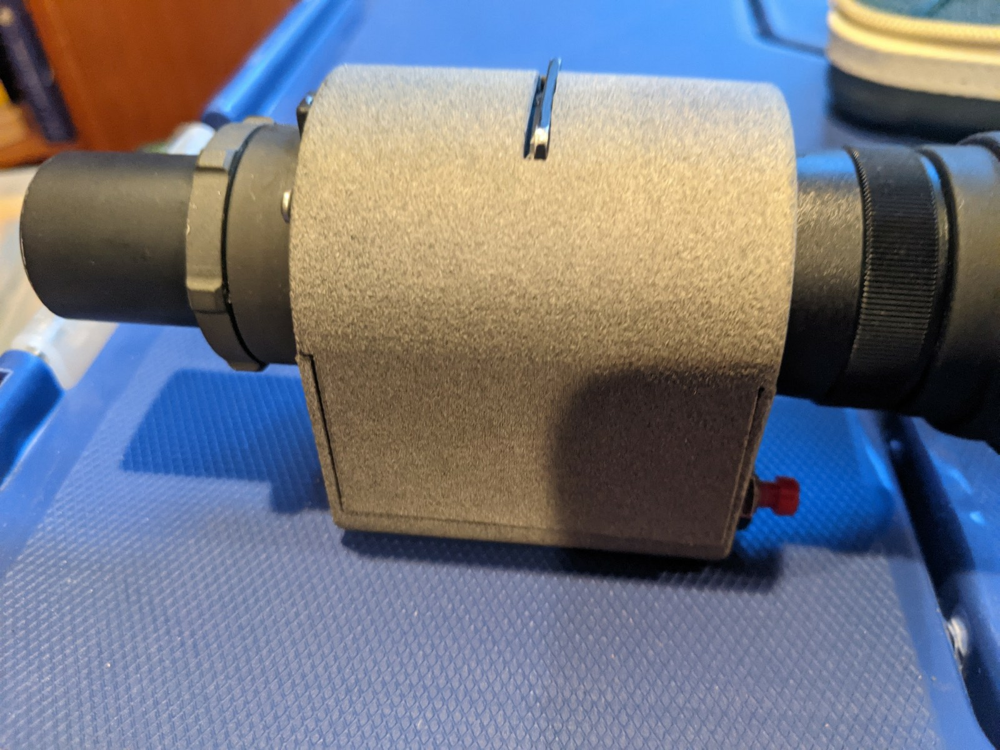
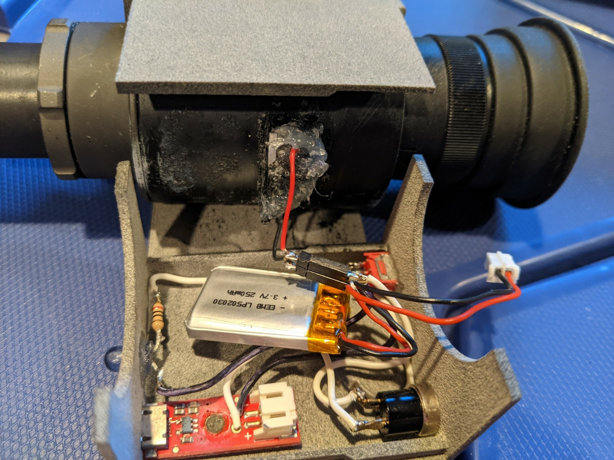

# Night Vision Monocular

Single tube from an AN/PVS-5 night vision goggle that I got at the Foothill hamfest in the early 1990s.

Created a 3D-printed case with LiPo battery, uUSB charger, momentary on switch, and IR LED illuminator option.

*TBD*

